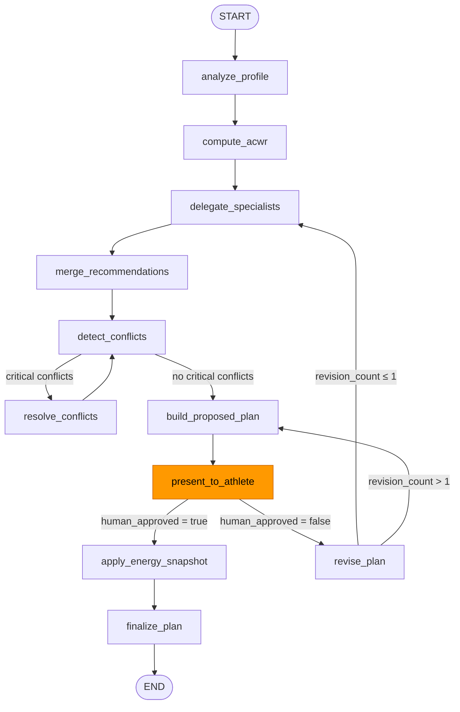
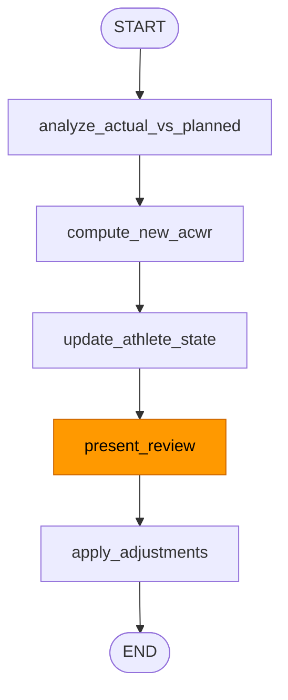

# Human-in-the-Loop — Resilio Plus Coaching Flows

> **Source** : `backend/app/graphs/coaching_graph.py`, `backend/app/graphs/weekly_review_graph.py`, `backend/app/services/coaching_service.py`
> **Généré le** : 2026-04-16 depuis le code source.

---

## Table des matières

1. [Vue d'ensemble](#vue-densemble)
2. [Coaching Graph — création de plan](#coaching-graph--création-de-plan)
   - [Diagramme Mermaid](#diagramme-mermaid)
   - [Nœuds et états](#nœuds-et-états)
   - [Conditions de routage](#conditions-de-routage)
   - [Pattern interrupt/resume](#pattern-interruptresume)
3. [Weekly Review Graph](#weekly-review-graph)
   - [Diagramme Mermaid](#diagramme-mermaid-1)
   - [Nœuds et états](#nœuds-et-états-1)
4. [Format standard — Situation présentée](#format-standard--situation-présentée)
5. [Format standard — Recommandation](#format-standard--recommandation)
6. [Cas d'usage human-in-the-loop](#cas-dusage-human-in-the-loop)
7. [Bug corrigé — `_after_revise` routing](#bug-corrigé--_after_revise-routing)
8. [CoachingService API](#coachingservice-api)

---

## Vue d'ensemble

Deux graphs LangGraph avec interruption humaine :

| Graph | Fichier | Interrupt node | API endpoints |
|-------|---------|----------------|---------------|
| Coaching (plan création) | `coaching_graph.py` | `present_to_athlete` | `POST /workflow/create-plan` → `POST /workflow/plans/{thread_id}/approve` ou `/revise` |
| Weekly Review | `weekly_review_graph.py` | `present_review` | `POST /plan/review/start` → `POST /plan/review/confirm` |

**Mécanisme de checkpoint** : `SqliteSaver` en production (`LANGGRAPH_CHECKPOINT_DB`). L'état du graph survit entre les deux appels HTTP (create + approve/reject).

---

## Coaching Graph — création de plan

### Diagramme Mermaid



### Nœuds et états

**State type** : `AthleteCoachingState` (TypedDict)

| Nœud | Rôle | Champs modifiés |
|------|------|-----------------|
| `analyze_profile` | Charge le profil athlete depuis `athlete_dict` | `athlete_id`, `athlete_dict` |
| `compute_acwr` | Calcule l'ACWR depuis `load_history` | `acwr_dict` |
| `delegate_specialists` | Appelle `HeadCoach.build_week()` → tous les agents | `recommendations_dicts`, `budgets` |
| `merge_recommendations` | Agrège les sessions proposées | `recommendations_dicts` (merge) |
| `detect_conflicts` | `detect_conflicts(recommendations)` | `conflicts_dicts` |
| `resolve_conflicts` | Résout les conflits CRITICAL | `conflicts_dicts` (mise à jour) |
| `build_proposed_plan` | Construit `WeeklyPlan` final | `proposed_plan_dict` |
| `present_to_athlete` | **INTERRUPT** — no-op, attend décision humaine | `human_approved`, `human_feedback` |
| `revise_plan` | Applique le feedback, prépare re-délégation | `proposed_plan_dict = None`, message "Replanification en cours" |
| `apply_energy_snapshot` | Intègre `EnergySnapshot` courant | `energy_snapshot_dict` |
| `finalize_plan` | Persiste le plan en base | `final_plan_dict` |

**Tous les nœuds sont wrappés avec `log_node`** → logs JSON structurés au niveau `resilio.graph` (voir `OBSERVABILITY.md`).

### Conditions de routage

#### `_has_critical_conflicts(state)` → `"resolve"` ou `"build"`

```python
def _has_critical_conflicts(state: AthleteCoachingState) -> str:
    conflicts = state.get("conflicts_dicts", [])
    has_critical = any(c.get("severity") == "critical" for c in conflicts)
    return "resolve" if has_critical else "build"
```

Loop `resolve_conflicts ↔ detect_conflicts` jusqu'à ce qu'il n'y ait plus de conflits CRITICAL.

#### `_after_present(state)` → `"apply_energy"` ou `"revise"`

```python
def _after_present(state: AthleteCoachingState) -> str:
    return "apply_energy" if state.get("human_approved") else "revise"
```

#### `_after_revise(state)` → `"delegate"` ou `"build"`

```python
def _after_revise(state: AthleteCoachingState) -> str:
    revision_count = sum(
        1 for m in state.get("messages", [])
        if hasattr(m, "content") and "Replanification en cours" in m.content
    )
    if revision_count <= 1:
        return "delegate"   # re-délégation complète (tous les agents)
    return "build"           # reconstruction depuis recs existantes (cap atteint)
```

Voir [Bug corrigé](#bug-corrigé--_after_revise-routing) pour l'histoire de cette règle.

### Pattern interrupt/resume

```
Phase 1 — Création :
  POST /athletes/{id}/workflow/create-plan
  → CoachingService.create_plan(athlete_id, athlete_dict, load_history, db)
  → graph.invoke(initial_state, config)
  → graph s'arrête à interrupt_before=["present_to_athlete"]
  → retourne (thread_id, proposed_plan_dict)

Athlete review (asynchrone — peut durer des minutes/heures)
  → L'état est persisté dans SqliteSaver via thread_id

Phase 2 — Décision :
  POST /athletes/{id}/workflow/plans/{thread_id}/approve
  POST /athletes/{id}/workflow/plans/{thread_id}/revise

  → CoachingService.resume_plan(thread_id, approved, feedback, db)
  → graph.update_state(config, {human_approved, human_feedback}, as_node="present_to_athlete")
  → graph.invoke(None, config)   ← None = reprendre depuis le checkpoint
  → si approved : retourne final_plan_dict
  → si rejected : retourne nouveau proposed_plan_dict (révision)
```

**Important** : `graph.invoke(None, config)` est le pattern LangGraph 0.6.x pour reprendre depuis un checkpoint après interrupt. `None` comme input signifie "continuer depuis où on s'est arrêté".

---

## Weekly Review Graph

### Diagramme Mermaid



### Nœuds et états

**State type** : `WeeklyReviewState` (TypedDict)

| Nœud | Rôle | Champs modifiés |
|------|------|-----------------|
| `analyze_actual_vs_planned` | Compte séances planifiées vs complétées, calcule `actual_hours` | `sessions_planned`, `sessions_completed`, `completion_rate`, `actual_hours` |
| `compute_new_acwr` | Recalcule ACWR depuis `load_history` | `acwr_dict` |
| `update_athlete_state` | Assemble `review_summary_dict` avec readiness + recommandations | `review_summary_dict` |
| `present_review` | **INTERRUPT** — no-op, attend confirmation humaine | `human_approved` |
| `apply_adjustments` | Persiste `WeeklyReviewModel` en base si `human_approved=True` | `db_review_id` |

**Checkpointer** : `MemorySaver` (en mémoire — le review graph est éphémère, pas besoin de persistance cross-session).

### Pattern interrupt/resume (weekly review)

```
Phase 1 — Start :
  POST /athletes/{id}/plan/review/start
  → CoachingService.weekly_review(athlete_id, db)
  → graph s'arrête à interrupt_before=["present_review"]
  → retourne (thread_id, review_summary_dict)

Phase 2 — Confirm :
  POST /athletes/{id}/plan/review/confirm  { thread_id, approved }
  → CoachingService.resume_review(thread_id, approved, db)
  → review_graph.update_state(config, {"human_approved": approved}, as_node="present_review")
  → review_graph.invoke(None, config)
  → si approved : WeeklyReviewModel persisté en DB
  → si rejected : message "Révision annulée"
```

**Reconstruction après restart** : si `thread_id` n'est plus dans `_review_graphs` (restart service), `resume_review()` reconstruit le graph via `build_weekly_review_graph(interrupt=True)`. Le checkpoint MemorySaver est perdu — la review ne peut pas être resumée après restart.

---

## Format standard — Situation présentée

À l'étape `present_to_athlete`, le `proposed_plan_dict` contient le résumé de la semaine proposée. Structure attendue :

```typescript
interface ProposedPlanDict {
  // Contexte
  week_number: number;
  phase: string;             // "base" | "build" | "peak" | "taper" | "recovery"
  weeks_remaining: number;

  // Charge
  acwr: number;
  acwr_status: string;       // "safe" | "caution" | "danger"
  readiness_level: string;   // "green" | "yellow" | "red"
  total_weekly_hours: number;

  // Sessions proposées
  sessions: WorkoutSlot[];

  // Notes agents (texte brut)
  notes: string[];           // une entrée par agent actif

  // Conflits détectés (vides si aucun)
  conflicts: ConflictDict[];
}
```

**Présentation à l'athlète** (Head Coach — format prompt) :

```
Situation actuelle
ACWR 1.12 (safe). Semaine 3, phase base. 8h d'entraînement planifiées.
HRV stable. Readiness : vert.

Décision d'entraînement
3 séances course (2×Z1 facile + 1 tempo Z2), 2 séances force (upper strength + lower hypertrophy).
Volume course identique semaine précédente. Volume muscu : DUP bloc intensification.

Nutrition
Journées endurance : glucides 5.5g/kg, protéines 1.8g/kg.

Point de vigilance
ACWR montera à 1.28 si toutes les séances sont complétées — surveiller RPE fin de semaine.
```

---

## Format standard — Recommandation

À l'étape `update_athlete_state` (weekly review), le `review_summary_dict` contient :

```typescript
interface ReviewSummaryDict {
  week_number: number;
  week_start: string;          // "2026-04-14"
  sessions_planned: number;
  sessions_completed: number;
  completion_rate: number;     // 0.0 → 1.0
  actual_hours: number;
  acwr: number | null;
  readiness: "green" | "yellow" | "red" | null;
  recommendations: string[];   // 1–3 phrases cliniques, ton non-motivationnel
}
```

**Exemples de recommandations générées** (extrait `_build_recommendations()`) :

```python
# ACWR "red" (> 1.5)
["ACWR > 1.5 — réduire le volume de 20% la semaine prochaine.",
 "Prioriser le sommeil et la récupération active."]

# ACWR "yellow" (1.3–1.5)
["ACWR entre 1.3 et 1.5 — maintenir le volume, pas d'augmentation.",
 "Surveiller les signaux de fatigue (FC repos, humeur, RPE)."]

# ACWR "green" + complétion >= 90%
["Excellente semaine! Tu peux augmenter légèrement le volume (+5–10%)."]

# Complétion < 50%
["Moins de 50% des séances complétées — envisager de réduire la densité du plan."]
```

---

## Cas d'usage human-in-the-loop

### Cas 1 — Approbation directe

```
POST /workflow/create-plan  →  proposed_plan_dict + thread_id
  └─ Athlete lit le plan                            [asynchrone]
POST /workflow/plans/{thread_id}/approve  →  final_plan_dict
  └─ Graph reprend : apply_energy → finalize → END
  └─ Plan persisté en base
```

### Cas 2 — Première révision

```
POST /workflow/create-plan  →  thread_id
POST /workflow/plans/{thread_id}/revise  { feedback: "Trop de volume vendredi" }
  └─ revise_plan  →  revision_count = 1  ≤ 1
  └─ Route : delegate_specialists (re-délégation complète)
  └─ Tous les agents réanalysent avec feedback injecté
  →  nouveau proposed_plan_dict retourné

POST /workflow/plans/{thread_id}/approve  →  final_plan_dict
```

### Cas 3 — Deuxième révision (cap atteint)

```
POST /workflow/plans/{thread_id}/revise  [1ère révision]
  └─ revision_count = 1  →  delegate_specialists
POST /workflow/plans/{thread_id}/revise  [2ème révision]
  └─ revision_count = 2  >  1
  └─ Route : build_proposed_plan (reconstruit depuis recs existantes, pas de re-délégation)
  └─ Évite boucle infinie, préserve les recommandations actuelles
POST /workflow/plans/{thread_id}/approve  →  final_plan_dict
```

### Cas 4 — Weekly review rejetée

```
POST /plan/review/start  →  review_summary_dict + thread_id
POST /plan/review/confirm  { approved: false }
  └─ apply_adjustments : human_approved=false → aucune écriture DB
  └─ Message : "Révision hebdomadaire annulée par l'athlète."
  └─ db_review_id = null
```

### Cas 5 — Timeout / perte de thread_id

Si l'athlète n'appelle jamais `/approve` ni `/revise` :
- Le checkpoint reste dans `SqliteSaver` (coaching graph) ou `MemorySaver` (weekly review)
- Aucun cleanup automatique pour le coaching graph
- Le weekly review graph est perdu après restart service (`MemorySaver` éphémère)
- **Recommandation frontend** : stocker `thread_id` en storage persistant (SecureStore / AsyncStorage), afficher l'état pending au prochain démarrage de l'app

### Cas 6 — Debug état graph

```
GET /athletes/{id}/coach/session/{thread_id}/state
→ SessionStateResponse { thread_id, state: dict, checkpoint_ts }
```

Retourne le `StateSnapshot.values` brut du checkpoint — utilisé pour debugger où le graph s'est arrêté.

---

## Bug corrigé — `_after_revise` routing

**Fichier** : `backend/app/graphs/coaching_graph.py::_after_revise()`

**Référence** : documenté dans `docs/backend/LANGGRAPH-FLOW.md` §"_after_revise routing bug"

### Symptôme

Quand un athlete demandait une **deuxième révision** (`revision_count > 1`), le plan final était vide ou corrompu.

### Cause

```python
# AVANT (bug)
def _after_revise(state) -> str:
    if revision_count > 1:
        return "present_to_athlete"   # ❌ MAUVAIS
```

`revise_plan` efface `proposed_plan_dict = None` avant de router. Si le routing allait directement vers `present_to_athlete`, le plan présenté était `None`.

### Fix

```python
# APRÈS (corrigé)
def _after_revise(state) -> str:
    if revision_count <= 1:
        return "delegate"       # re-délégation complète
    return "build"              # rebuild depuis recs existantes ← clé du fix
```

En routant vers `build_proposed_plan` (et non vers `present_to_athlete`), le nœud `build_proposed_plan` reconstruit `proposed_plan_dict` depuis les `recommendations_dicts` existants **avant** la présentation. Le plan est valide.

### Pourquoi "delegate" pour revision ≤ 1

La première révision déclenche une **re-délégation complète** (`delegate_specialists`) pour permettre aux agents de réanalyser avec le feedback injecté. C'est intentionnel — le feedback peut changer les budgets, les zones, etc.

La deuxième révision utilise les **recommandations existantes** pour éviter un loop infini de délégation et maintenir la cohérence du plan.

---

## CoachingService API

**Fichier** : `backend/app/services/coaching_service.py`

```python
# Singleton module-level — partagé entre toutes les routes
from app.services.coaching_service import coaching_service

# Coaching graph
thread_id, proposed_dict = coaching_service.create_plan(
    athlete_id: str,
    athlete_dict: dict[str, Any],
    load_history: list[float],  # charges passées oldest-first
    db: Session,
) -> tuple[str, dict[str, Any] | None]

final_dict = coaching_service.resume_plan(
    thread_id: str,
    approved: bool,
    feedback: str | None,
    db: Session,
) -> dict[str, Any] | None
# retourne final_plan_dict si approved, nouveau proposed_plan_dict si rejected

# Weekly review
thread_id, summary = coaching_service.weekly_review(
    athlete_id: str,
    db: Session,
) -> tuple[str, dict[str, Any] | None]

coaching_service.resume_review(
    thread_id: str,
    approved: bool,
    db: Session,
) -> None  # écrit WeeklyReviewModel si approved

# Debug
snapshot = coaching_service.get_graph_state(thread_id: str)
# retourne StateSnapshot (LangGraph) — .values contient AthleteCoachingState
```

### SQLite checkpointer (production)

```python
# Pattern de connexion — critique pour gunicorn multi-workers
conn = sqlite3.connect(db_path, check_same_thread=False, timeout=30.0)
conn.execute("PRAGMA busy_timeout=30000")
conn.execute("PRAGMA journal_mode=WAL")
```

Le `PRAGMA journal_mode=WAL` **doit** être exécuté dans un process unique avant que gunicorn ne fork. L'entrypoint Docker (`docker-entrypoint-backend.sh`) s'en charge. Si exécuté concurremment par plusieurs workers → `SQLITE_BUSY` (voir `DEPLOYMENT.md::Docker Gotchas`).

### Tests — créer un service isolé

```python
# Tests : ne jamais utiliser le singleton — créer une instance locale avec MemorySaver
from langgraph.checkpoint.memory import MemorySaver
from app.services.coaching_service import CoachingService

service = CoachingService(checkpointer=MemorySaver())
```
