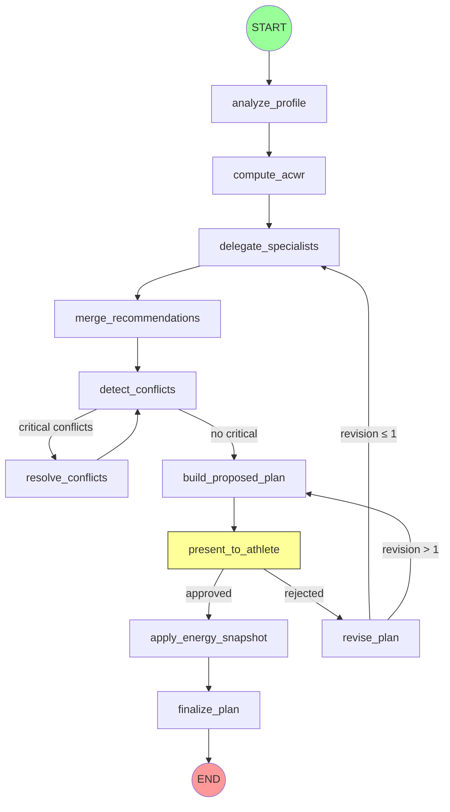

# LangGraph Coaching Flow

Reference documentation for the LangGraph coaching planning graph.

## Graph Topology



**Yellow node** = interrupt point (graph pauses here for human review).

## Node Reference

| Node | Purpose | Reads from state | Writes to state |
|---|---|---|---|
| `analyze_profile` | Compute goal-driven sport budgets | `athlete_dict` | `budgets` |
| `compute_acwr` | Calculate ACWR from load history | `load_history`, `recommendations_dicts` | `acwr_dict` |
| `delegate_specialists` | Invoke sport-specific agents | `athlete_dict`, `budgets` | `recommendations_dicts` |
| `merge_recommendations` | No-op pass-through (future hook) | — | — |
| `detect_conflicts` | Find scheduling conflicts | `recommendations_dicts` | `conflicts_dicts` |
| `resolve_conflicts` | Log critical conflicts | `conflicts_dicts` | (messages only) |
| `build_proposed_plan` | Build WeeklyPlan from recommendations | `athlete_dict`, `recommendations_dicts`, `acwr_dict`, `conflicts_dicts` | `proposed_plan_dict` |
| `present_to_athlete` | Marker for HITL interrupt | — | (messages only) |
| `revise_plan` | Clear proposed plan, store feedback | `human_feedback` | `proposed_plan_dict=None`, `human_approved=False`, `human_feedback=None` |
| `apply_energy_snapshot` | Scale sessions by energy cap | `proposed_plan_dict`, `athlete_id` (+ DB) | `energy_snapshot_dict`, `proposed_plan_dict` |
| `finalize_plan` | Persist TrainingPlanModel to DB | `proposed_plan_dict`, `athlete_id` (+ DB) | `final_plan_dict` |

## Conditional Edges

### `_has_critical_conflicts` (after `detect_conflicts`)
- **"resolve"** → `resolve_conflicts`: if any conflict has `severity == "critical"`
- **"build"** → `build_proposed_plan`: no critical conflicts

### `_after_present` (after `present_to_athlete`)
- **"apply_energy"** → `apply_energy_snapshot`: if `human_approved == True`
- **"revise"** → `revise_plan`: if `human_approved == False`

### `_after_revise` (after `revise_plan`)
- **"delegate"** → `delegate_specialists`: if revision count ≤ 1 (loop back for re-planning)
- **"build"** → `build_proposed_plan`: if revision count > 1 (max revisions reached — rebuild from existing recommendations, no re-delegation)

Revision count is determined by counting messages containing `"Replanification en cours"`.

## Interrupt Behavior

The graph uses `interrupt_before=["present_to_athlete"]` in production mode.

**Create flow:**
1. Client calls `CoachingService.create_plan(athlete_id, athlete_dict, load_history, db)`
2. Graph runs nodes 1-8, then pauses before `present_to_athlete`
3. Returns `(thread_id, proposed_plan_dict)`

**Resume flow:**
1. Client calls `CoachingService.resume_plan(thread_id, approved, feedback, db)`
2. Service calls `graph.update_state(config, {human_approved, human_feedback}, as_node="present_to_athlete")`
3. Service calls `graph.invoke(None, config)` to resume from checkpoint
4. If approved: runs `apply_energy_snapshot → finalize_plan → END`
5. If rejected: runs `revise_plan → delegate_specialists → ... → present_to_athlete` (pauses again)

## Checkpoint Lifecycle

**Checkpointer:** `SqliteSaver` (production), `MemorySaver` (tests).

**Thread ID format:** `"{athlete_id}:{uuid4}"` — e.g., `"athlete-123:a1b2c3d4-..."`.

**Persistence:** SQLite file at `LANGGRAPH_CHECKPOINT_DB` env var (default: `data/checkpoints.sqlite`).

**Ownership validation:** Thread ID prefix must match authenticated athlete's ID.

## State Schema

See `backend/app/graphs/state.py` — `AthleteCoachingState` TypedDict with 13 fields. All values are JSON-serializable (no ORM objects). DB session passed via `config["configurable"]["db"]`.

## Structured Logging

Every node is wrapped with `log_node` decorator. Emits JSON to `resilio.graph` logger:

```json
{"event": "node_enter", "node": "analyze_profile", "athlete_id": "abc-123"}
{"event": "node_exit", "node": "analyze_profile", "athlete_id": "abc-123", "duration_ms": 12, "keys_changed": ["budgets"]}
```

## Debug Endpoint

```
GET /athletes/{athlete_id}/coach/session/{thread_id}/state
```

Athlete-scoped (JWT required, thread ownership validated). Returns current graph state snapshot.
