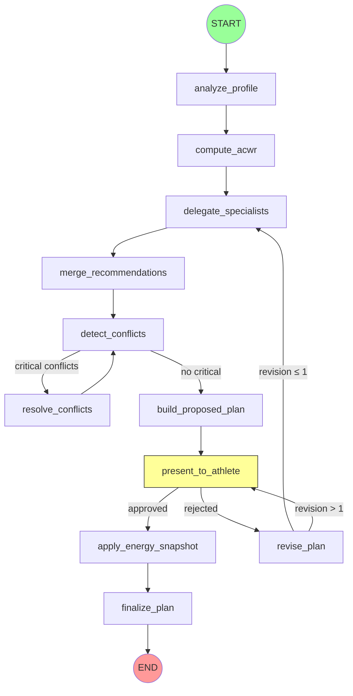

# LangGraph Runtime Validation Implementation Plan

> **For agentic workers:** REQUIRED SUB-SKILL: Use superpowers:subagent-driven-development (recommended) or superpowers:executing-plans to implement this plan task-by-task. Steps use checkbox (`- [ ]`) syntax for tracking.

**Goal:** Fix checkpoint persistence (MemorySaver → SQLite), make CoachingService a singleton, add runtime tests, structured logging, debug endpoint, and documentation.

**Architecture:** `build_coaching_graph()` takes a `checkpointer` param (dependency injection). `CoachingService` becomes a module-level singleton with SQLite checkpointer. `workflow.py` imports the singleton instead of creating new instances. Node logging via decorator. Runtime tests mock at agent `.analyze()` level.

**Tech Stack:** LangGraph 0.6.x, `langgraph-checkpoint-sqlite` (SqliteSaver), Python stdlib `logging`, pytest, SQLite.

**Spec:** `docs/superpowers/specs/2026-04-14-langgraph-runtime-design.md`

---

## File Structure

| File | Responsibility |
|---|---|
| `backend/app/graphs/coaching_graph.py` | Graph factory — accepts checkpointer param, wraps nodes with log_node |
| `backend/app/graphs/logging.py` | **New** — `log_node` decorator for structured JSON logging |
| `backend/app/services/coaching_service.py` | CoachingService with checkpointer injection + module singleton |
| `backend/app/routes/workflow.py` | Import singleton, debug endpoint, remove per-request instantiation |
| `pyproject.toml` | Add `langgraph-checkpoint-sqlite` dependency |
| `tests/runtime/__init__.py` | **New** — package marker |
| `tests/runtime/conftest.py` | **New** — mock agents, canned responses, DB fixtures |
| `tests/runtime/test_graph_topology.py` | **New** — node reachability, conditional edge routing |
| `tests/runtime/test_checkpoint_persistence.py` | **New** — SQLite checkpoint survives service restart |
| `tests/runtime/test_interrupt_resume.py` | **New** — interrupt/approve/reject/revise flows |
| `tests/runtime/test_state_transitions.py` | **New** — each node produces correct state keys |
| `tests/runtime/test_revision_loop.py` | **New** — max 1 revision enforced |
| `scripts/smoke_test_runtime.py` | **New** — manual smoke test with real LLM calls |
| `docs/backend/LANGGRAPH-FLOW.md` | **New** — graph documentation with mermaid diagram |

---

### Task 1: Add `langgraph-checkpoint-sqlite` dependency

**Files:**
- Modify: `pyproject.toml:28` (dependencies list)

- [ ] **Step 1: Add dependency to pyproject.toml**

In `pyproject.toml`, find the line:
```
    "langgraph (>=0.2,<1.0)",
```
Add immediately after it:
```
    "langgraph-checkpoint-sqlite (>=3.0,<4.0)",
```

- [ ] **Step 2: Install**

Run: `cd C:/Users/simon/resilio-plus && poetry lock --no-update && poetry install`
Expected: SUCCESS, `langgraph-checkpoint-sqlite` installed.

- [ ] **Step 3: Verify import**

Run: `cd C:/Users/simon/resilio-plus && C:/Users/simon/AppData/Local/pypoetry/Cache/virtualenvs/resilio-8kDCl3fk-py3.13/Scripts/python.exe -c "from langgraph.checkpoint.sqlite import SqliteSaver; print('OK')"`
Expected: `OK`

- [ ] **Step 4: Commit**

```bash
git add pyproject.toml poetry.lock
git commit -m "chore: add langgraph-checkpoint-sqlite dependency"
```

---

### Task 2: Create `log_node` decorator

**Files:**
- Create: `backend/app/graphs/logging.py`
- Test: `tests/runtime/test_graph_topology.py` (partial — logging tested here)

- [ ] **Step 1: Write the test**

Create `tests/runtime/__init__.py` (empty file).

Create `tests/runtime/test_logging.py`:

```python
# tests/runtime/test_logging.py
"""Tests for the log_node decorator."""
from __future__ import annotations

import json
import logging

from app.graphs.logging import log_node


def test_log_node_calls_function_and_returns_result():
    """log_node wrapper calls the original function and returns its result."""
    def my_node(state, config=None):
        return {"budgets": {"running": 5.0}}

    wrapped = log_node(my_node)
    result = wrapped({"athlete_id": "test-1"})
    assert result == {"budgets": {"running": 5.0}}


def test_log_node_emits_enter_and_exit(caplog):
    """log_node emits JSON logs with node_enter and node_exit events."""
    def my_node(state, config=None):
        return {"budgets": {}}

    wrapped = log_node(my_node)

    with caplog.at_level(logging.INFO, logger="resilio.graph"):
        wrapped({"athlete_id": "a1"})

    json_logs = [json.loads(r.message) for r in caplog.records if r.name == "resilio.graph"]
    events = [log["event"] for log in json_logs]
    assert "node_enter" in events
    assert "node_exit" in events

    exit_log = next(log for log in json_logs if log["event"] == "node_exit")
    assert exit_log["node"] == "my_node"
    assert exit_log["athlete_id"] == "a1"
    assert "duration_ms" in exit_log
    assert exit_log["keys_changed"] == ["budgets"]


def test_log_node_preserves_function_name():
    """log_node preserves __name__ for LangGraph node registration."""
    def analyze_profile(state, config=None):
        return {}

    wrapped = log_node(analyze_profile)
    assert wrapped.__name__ == "analyze_profile"
```

- [ ] **Step 2: Run tests to verify they fail**

Run: `cd C:/Users/simon/resilio-plus/backend && C:/Users/simon/AppData/Local/pypoetry/Cache/virtualenvs/resilio-8kDCl3fk-py3.13/Scripts/pytest.exe ../tests/runtime/test_logging.py -v`
Expected: FAIL — `ModuleNotFoundError: No module named 'app.graphs.logging'`

- [ ] **Step 3: Implement log_node**

Create `backend/app/graphs/logging.py`:

```python
"""Structured JSON logging decorator for LangGraph node functions.

Usage:
    from .logging import log_node
    builder.add_node("analyze_profile", log_node(analyze_profile))

Emits two JSON log lines per node invocation:
    {"event": "node_enter", "node": "<name>", "athlete_id": "<id>"}
    {"event": "node_exit",  "node": "<name>", "athlete_id": "<id>", "duration_ms": N, "keys_changed": [...]}
"""
from __future__ import annotations

import json
import logging
import time
from functools import wraps
from typing import Any

logger = logging.getLogger("resilio.graph")


def log_node(func):
    """Decorator that logs entry/exit for a LangGraph node function."""
    @wraps(func)
    def wrapper(state: dict[str, Any], config=None) -> dict[str, Any]:
        node = func.__name__
        athlete = state.get("athlete_id", "?")
        logger.info(json.dumps({
            "event": "node_enter",
            "node": node,
            "athlete_id": athlete,
        }))
        t0 = time.perf_counter()
        result = func(state, config) if config is not None else func(state)
        ms = round((time.perf_counter() - t0) * 1000)
        changed = list(result.keys()) if isinstance(result, dict) else []
        logger.info(json.dumps({
            "event": "node_exit",
            "node": node,
            "athlete_id": athlete,
            "duration_ms": ms,
            "keys_changed": changed,
        }))
        return result
    return wrapper
```

- [ ] **Step 4: Run tests to verify they pass**

Run: `cd C:/Users/simon/resilio-plus/backend && C:/Users/simon/AppData/Local/pypoetry/Cache/virtualenvs/resilio-8kDCl3fk-py3.13/Scripts/pytest.exe ../tests/runtime/test_logging.py -v`
Expected: 3 PASSED

- [ ] **Step 5: Commit**

```bash
git add backend/app/graphs/logging.py tests/runtime/__init__.py tests/runtime/test_logging.py
git commit -m "feat(graphs): add log_node decorator for structured node logging"
```

---

### Task 3: Refactor `build_coaching_graph()` — checkpointer injection + logging

**Files:**
- Modify: `backend/app/graphs/coaching_graph.py:1-115`

- [ ] **Step 1: Write the test**

Create `tests/runtime/test_graph_topology.py`:

```python
# tests/runtime/test_graph_topology.py
"""Tests for coaching graph topology — node registration, edge routing."""
from __future__ import annotations

import pytest
from langgraph.checkpoint.memory import MemorySaver

from app.graphs.coaching_graph import build_coaching_graph


def test_build_coaching_graph_requires_checkpointer():
    """build_coaching_graph raises TypeError without checkpointer arg."""
    with pytest.raises(TypeError):
        build_coaching_graph()


def test_build_coaching_graph_accepts_checkpointer():
    """build_coaching_graph accepts a checkpointer and returns a compiled graph."""
    graph = build_coaching_graph(checkpointer=MemorySaver())
    assert graph is not None


def test_graph_has_all_11_nodes():
    """The compiled graph contains all 11 expected nodes."""
    graph = build_coaching_graph(checkpointer=MemorySaver())
    # LangGraph compiled graph exposes nodes via .nodes
    node_names = set(graph.nodes.keys())
    expected = {
        "analyze_profile", "compute_acwr", "delegate_specialists",
        "merge_recommendations", "detect_conflicts", "resolve_conflicts",
        "build_proposed_plan", "present_to_athlete", "revise_plan",
        "apply_energy_snapshot", "finalize_plan",
    }
    # __start__ and __end__ are internal LangGraph nodes, exclude them
    actual = node_names - {"__start__", "__end__"}
    assert expected == actual, f"Missing: {expected - actual}, Extra: {actual - expected}"


def test_graph_interrupt_before_present_to_athlete():
    """With interrupt=True, graph interrupts before present_to_athlete."""
    graph = build_coaching_graph(checkpointer=MemorySaver(), interrupt=True)
    # LangGraph exposes interrupt config
    assert "present_to_athlete" in (graph.interrupt_before_nodes or [])


def test_graph_no_interrupt_when_false():
    """With interrupt=False, graph does not interrupt."""
    graph = build_coaching_graph(checkpointer=MemorySaver(), interrupt=False)
    assert not (graph.interrupt_before_nodes or [])
```

- [ ] **Step 2: Run tests to verify they fail**

Run: `cd C:/Users/simon/resilio-plus/backend && C:/Users/simon/AppData/Local/pypoetry/Cache/virtualenvs/resilio-8kDCl3fk-py3.13/Scripts/pytest.exe ../tests/runtime/test_graph_topology.py -v`
Expected: FAIL — `test_build_coaching_graph_requires_checkpointer` fails (current signature has default MemorySaver)

- [ ] **Step 3: Modify coaching_graph.py**

Replace the full content of `backend/app/graphs/coaching_graph.py`:

```python
"""Coaching graph factory — builds and compiles the LangGraph StateGraph.

Usage:
    from langgraph.checkpoint.memory import MemorySaver
    graph = build_coaching_graph(checkpointer=MemorySaver(), interrupt=True)

Thread IDs are generated by CoachingService and passed as config["configurable"]["thread_id"].
"""
from __future__ import annotations

from langgraph.graph import END, START, StateGraph

from .logging import log_node
from .nodes import (
    analyze_profile,
    apply_energy_snapshot,
    build_proposed_plan,
    compute_acwr,
    delegate_specialists,
    detect_conflicts_node,
    finalize_plan,
    merge_recommendations,
    present_to_athlete,
    resolve_conflicts_node,
    revise_plan,
)
from .state import AthleteCoachingState


def _has_critical_conflicts(state: AthleteCoachingState) -> str:
    conflicts = state.get("conflicts_dicts", [])
    has_critical = any(c.get("severity") == "critical" for c in conflicts)
    return "resolve" if has_critical else "build"


def _after_present(state: AthleteCoachingState) -> str:
    return "apply_energy" if state.get("human_approved") else "revise"


def _after_revise(state: AthleteCoachingState) -> str:
    # Count revision messages to enforce max 1 revision
    revision_count = sum(
        1 for m in state.get("messages", [])
        if hasattr(m, "content") and "Replanification en cours" in m.content
    )
    if revision_count <= 1:
        return "delegate"
    return "present"


def build_coaching_graph(*, checkpointer, interrupt: bool = True):
    """Build and compile the coaching StateGraph.

    Args:
        checkpointer: LangGraph checkpoint saver (MemorySaver, SqliteSaver, etc.).
        interrupt: If True, pauses at present_to_athlete (production).
                   If False, skips interrupt — human_approved must be pre-set in state (tests).
    """
    builder = StateGraph(AthleteCoachingState)

    # Register all nodes with structured logging
    builder.add_node("analyze_profile", log_node(analyze_profile))
    builder.add_node("compute_acwr", log_node(compute_acwr))
    builder.add_node("delegate_specialists", log_node(delegate_specialists))
    builder.add_node("merge_recommendations", log_node(merge_recommendations))
    builder.add_node("detect_conflicts", log_node(detect_conflicts_node))
    builder.add_node("resolve_conflicts", log_node(resolve_conflicts_node))
    builder.add_node("build_proposed_plan", log_node(build_proposed_plan))
    builder.add_node("present_to_athlete", log_node(present_to_athlete))
    builder.add_node("revise_plan", log_node(revise_plan))
    builder.add_node("apply_energy_snapshot", log_node(apply_energy_snapshot))
    builder.add_node("finalize_plan", log_node(finalize_plan))

    # Linear pipeline
    builder.add_edge(START, "analyze_profile")
    builder.add_edge("analyze_profile", "compute_acwr")
    builder.add_edge("compute_acwr", "delegate_specialists")
    builder.add_edge("delegate_specialists", "merge_recommendations")
    builder.add_edge("merge_recommendations", "detect_conflicts")
    builder.add_edge("resolve_conflicts", "detect_conflicts")  # loop back after resolution

    # Conflict routing
    builder.add_conditional_edges(
        "detect_conflicts",
        _has_critical_conflicts,
        {"resolve": "resolve_conflicts", "build": "build_proposed_plan"},
    )

    # Plan presentation
    builder.add_edge("build_proposed_plan", "present_to_athlete")

    # Human review routing
    builder.add_conditional_edges(
        "present_to_athlete",
        _after_present,
        {"apply_energy": "apply_energy_snapshot", "revise": "revise_plan"},
    )

    # Revision routing (max 1 revision)
    builder.add_conditional_edges(
        "revise_plan",
        _after_revise,
        {"delegate": "delegate_specialists", "present": "present_to_athlete"},
    )

    builder.add_edge("apply_energy_snapshot", "finalize_plan")
    builder.add_edge("finalize_plan", END)

    interrupt_before = ["present_to_athlete"] if interrupt else []

    return builder.compile(
        checkpointer=checkpointer,
        interrupt_before=interrupt_before,
    )
```

- [ ] **Step 4: Run topology tests**

Run: `cd C:/Users/simon/resilio-plus/backend && C:/Users/simon/AppData/Local/pypoetry/Cache/virtualenvs/resilio-8kDCl3fk-py3.13/Scripts/pytest.exe ../tests/runtime/test_graph_topology.py -v`
Expected: 5 PASSED

- [ ] **Step 5: Commit**

```bash
git add backend/app/graphs/coaching_graph.py tests/runtime/test_graph_topology.py
git commit -m "refactor(graphs): make checkpointer a required param, add log_node wrapping"
```

---

### Task 4: Refactor `CoachingService` — checkpointer injection + singleton

**Files:**
- Modify: `backend/app/services/coaching_service.py:1-213`

- [ ] **Step 1: Write the test**

Create `tests/runtime/test_checkpoint_persistence.py`:

```python
# tests/runtime/test_checkpoint_persistence.py
"""Tests for checkpoint persistence — SQLite survives service restart."""
from __future__ import annotations

import sqlite3
import tempfile

import pytest
from langgraph.checkpoint.memory import MemorySaver
from langgraph.checkpoint.sqlite import SqliteSaver

from app.services.coaching_service import CoachingService


def test_coaching_service_accepts_checkpointer():
    """CoachingService can be created with an explicit checkpointer."""
    svc = CoachingService(checkpointer=MemorySaver())
    assert svc._graph is not None


def test_coaching_service_checkpointer_kwarg_only():
    """checkpointer must be passed as keyword argument."""
    # Should work with keyword
    svc = CoachingService(checkpointer=MemorySaver())
    assert svc is not None
```

- [ ] **Step 2: Run tests to verify they fail**

Run: `cd C:/Users/simon/resilio-plus/backend && C:/Users/simon/AppData/Local/pypoetry/Cache/virtualenvs/resilio-8kDCl3fk-py3.13/Scripts/pytest.exe ../tests/runtime/test_checkpoint_persistence.py::test_coaching_service_accepts_checkpointer -v`
Expected: FAIL — `CoachingService.__init__() got an unexpected keyword argument 'checkpointer'`

- [ ] **Step 3: Modify coaching_service.py**

Replace the `CoachingService` class `__init__` and add module-level singleton infrastructure. The full file becomes:

```python
"""CoachingService — wraps the LangGraph coaching graph.

Public API:
    from app.services.coaching_service import coaching_service  # singleton
    thread_id, proposed_dict = coaching_service.create_plan(athlete_id, athlete_dict, load_history, db)
    final_dict = coaching_service.resume_plan(thread_id, approved, feedback, db)
"""
from __future__ import annotations

import os
import sqlite3
import uuid
from typing import Any

from langgraph.checkpoint.memory import MemorySaver
from sqlalchemy.orm import Session

from ..graphs.coaching_graph import build_coaching_graph
from ..graphs.state import AthleteCoachingState
from ..graphs.weekly_review_graph import WeeklyReviewState, build_weekly_review_graph


def _create_sqlite_checkpointer():
    """Create a SqliteSaver backed by a file on disk.

    Path from LANGGRAPH_CHECKPOINT_DB env var, default 'data/checkpoints.sqlite'.
    """
    from langgraph.checkpoint.sqlite import SqliteSaver

    db_path = os.environ.get("LANGGRAPH_CHECKPOINT_DB", "data/checkpoints.sqlite")
    os.makedirs(os.path.dirname(db_path) or ".", exist_ok=True)
    conn = sqlite3.connect(db_path, check_same_thread=False)
    saver = SqliteSaver(conn)
    saver.setup()
    return saver


class CoachingService:
    """Wraps the coaching LangGraph graph."""

    def __init__(self, *, checkpointer=None) -> None:
        self._checkpointer = checkpointer if checkpointer is not None else _create_sqlite_checkpointer()
        self._graph = build_coaching_graph(
            checkpointer=self._checkpointer,
            interrupt=True,
        )
        # Stores compiled review graph instances keyed by thread_id for resume_review()
        self._review_graphs: dict[str, Any] = {}

    def create_plan(
        self,
        athlete_id: str,
        athlete_dict: dict[str, Any],
        load_history: list[float],
        db: Session,
    ) -> tuple[str, dict[str, Any] | None]:
        """Run graph until present_to_athlete interrupt.

        Returns (thread_id, proposed_plan_dict).
        """
        thread_id = f"{athlete_id}:{str(uuid.uuid4())}"
        config = {"configurable": {"thread_id": thread_id, "db": db}}

        initial_state: AthleteCoachingState = {
            "athlete_id": athlete_id,
            "athlete_dict": athlete_dict,
            "load_history": load_history,
            "budgets": {},
            "recommendations_dicts": [],
            "acwr_dict": None,
            "conflicts_dicts": [],
            "proposed_plan_dict": None,
            "energy_snapshot_dict": None,
            "human_approved": False,
            "human_feedback": None,
            "final_plan_dict": None,
            "messages": [],
        }

        result = self._graph.invoke(initial_state, config=config)
        return thread_id, result.get("proposed_plan_dict")

    def resume_plan(
        self,
        thread_id: str,
        approved: bool,
        feedback: str | None,
        db: Session,
    ) -> dict[str, Any] | None:
        """Resume graph after human review.

        Uses LangGraph 0.6.x update_state + invoke(None) pattern to resume
        from the present_to_athlete interrupt checkpoint.

        Returns final_plan_dict if approved, new proposed_plan_dict if rejected.
        """
        config = {"configurable": {"thread_id": thread_id, "db": db}}

        # Update state with human decision before resuming
        self._graph.update_state(
            config,
            {
                "human_approved": approved,
                "human_feedback": feedback,
            },
            as_node="present_to_athlete",
        )

        # Resume from checkpoint (None input = continue from where we left off)
        result = self._graph.invoke(None, config=config)

        if approved:
            return result.get("final_plan_dict")
        return result.get("proposed_plan_dict")

    # ---------------------------------------------------------------------------
    # Weekly review — S-3
    # ---------------------------------------------------------------------------

    def weekly_review(
        self,
        athlete_id: str,
        db: Session,
    ) -> tuple[str, dict[str, Any] | None]:
        """Start the weekly review graph, pause at present_review interrupt.

        Queries the latest TrainingPlan for the athlete to determine week context,
        builds the initial WeeklyReviewState, and runs the graph until the
        present_review interrupt checkpoint.

        Returns:
            (thread_id, review_summary_dict)
            review_summary_dict may be None if no sessions data is available yet.
        """
        import importlib
        from datetime import date, timedelta
        from sqlalchemy import desc
        importlib.import_module("app.models.schemas")  # registers V3 SA models first
        _db_models = importlib.import_module("app.db.models")
        TrainingPlanModel = _db_models.TrainingPlanModel
        WeeklyReviewModel = _db_models.WeeklyReviewModel

        # Determine current week context
        today = date.today()
        week_start = today - timedelta(days=today.weekday())

        plan = (
            db.query(TrainingPlanModel)
            .filter(TrainingPlanModel.athlete_id == athlete_id)
            .order_by(desc(TrainingPlanModel.created_at))
            .first()
        )
        plan_id = plan.id if plan else None
        week_number = 1
        if plan and plan.start_date:
            week_number = max(1, (today - plan.start_date).days // 7 + 1)

        # Build load_history from recent weekly reviews (sessions_completed as proxy for load)
        recent_reviews = (
            db.query(WeeklyReviewModel)
            .filter(WeeklyReviewModel.athlete_id == athlete_id)
            .order_by(desc(WeeklyReviewModel.week_start))
            .limit(28)
            .all()
        )
        import json as _json
        load_history: list[float] = []
        for rev in reversed(recent_reviews):
            try:
                results = _json.loads(rev.results_json)
                load_history.append(float(results.get("sessions_completed", 0)))
            except Exception:
                load_history.append(0.0)

        thread_id = f"{athlete_id}:review:{str(uuid.uuid4())}"
        config = {"configurable": {"thread_id": thread_id, "db": db}}

        review_graph = build_weekly_review_graph(interrupt=True)

        initial_state: WeeklyReviewState = {
            "athlete_id": athlete_id,
            "plan_id": plan_id,
            "week_start": week_start.isoformat(),
            "week_number": week_number,
            "sessions_planned": 0,
            "sessions_completed": 0,
            "completion_rate": 0.0,
            "actual_hours": 0.0,
            "load_history": load_history,
            "acwr_dict": None,
            "review_summary_dict": None,
            "human_approved": False,
            "db_review_id": None,
            "messages": [],
        }

        result = review_graph.invoke(initial_state, config=config)
        # Store graph reference for resume (keyed by thread_id)
        self._review_graphs[thread_id] = review_graph
        return thread_id, result.get("review_summary_dict")

    def resume_review(
        self,
        thread_id: str,
        approved: bool,
        db: Session,
    ) -> None:
        """Resume the weekly review graph after human confirmation.

        Injects human_approved into state, then continues the graph from
        the present_review checkpoint to apply_adjustments (DB write).

        Args:
            thread_id: Thread ID returned by weekly_review()
            approved:  True to persist WeeklyReviewModel; False to cancel
            db:        SQLAlchemy session (injected into graph config)
        """
        review_graph = self._review_graphs.get(thread_id)
        if review_graph is None:
            # Reconstruct graph for this thread (e.g., after service restart)
            review_graph = build_weekly_review_graph(interrupt=True)

        config = {"configurable": {"thread_id": thread_id, "db": db}}

        review_graph.update_state(
            config,
            {"human_approved": approved},
            as_node="present_review",
        )
        review_graph.invoke(None, config=config)
        # Clean up stored reference
        self._review_graphs.pop(thread_id, None)


# ---------------------------------------------------------------------------
# Module-level singleton — used by workflow.py and other route modules.
# Tests should create their own CoachingService(checkpointer=MemorySaver()).
# ---------------------------------------------------------------------------
coaching_service = CoachingService()
```

- [ ] **Step 4: Run tests**

Run: `cd C:/Users/simon/resilio-plus/backend && C:/Users/simon/AppData/Local/pypoetry/Cache/virtualenvs/resilio-8kDCl3fk-py3.13/Scripts/pytest.exe ../tests/runtime/test_checkpoint_persistence.py -v`
Expected: 2 PASSED

- [ ] **Step 5: Commit**

```bash
git add backend/app/services/coaching_service.py tests/runtime/test_checkpoint_persistence.py
git commit -m "refactor(service): add checkpointer injection + module singleton to CoachingService"
```

---

### Task 5: Fix `workflow.py` — use singleton + add debug endpoint

**Files:**
- Modify: `backend/app/routes/workflow.py:33,257,295,324,559`

- [ ] **Step 1: Write a test for the debug endpoint**

Add to `tests/runtime/test_graph_topology.py`:

```python
def test_debug_endpoint_schema():
    """The debug state endpoint response schema has required keys."""
    # This is a structural test — actual endpoint tested via E2E
    # Here we verify CoachingService.get_state works
    from langgraph.checkpoint.memory import MemorySaver
    from app.services.coaching_service import CoachingService

    svc = CoachingService(checkpointer=MemorySaver())
    # Non-existent thread should return None
    config = {"configurable": {"thread_id": "nonexistent:123"}}
    state = svc._graph.get_state(config)
    # get_state on nonexistent thread returns a StateSnapshot with empty values
    assert state is not None
```

- [ ] **Step 2: Run test to verify it passes (this is a structural test)**

Run: `cd C:/Users/simon/resilio-plus/backend && C:/Users/simon/AppData/Local/pypoetry/Cache/virtualenvs/resilio-8kDCl3fk-py3.13/Scripts/pytest.exe ../tests/runtime/test_graph_topology.py::test_debug_endpoint_schema -v`
Expected: PASS

- [ ] **Step 3: Modify workflow.py**

Make these changes to `backend/app/routes/workflow.py`:

**3a.** Change the import (line 33):
```python
# BEFORE
from ..services.coaching_service import CoachingService

# AFTER
from ..services.coaching_service import CoachingService, coaching_service
```

**3b.** In `create_plan_workflow()` (line 257), replace:
```python
    service = CoachingService()
```
with:
```python
    service = coaching_service
```

**3c.** In `approve_plan()` (line 295), replace:
```python
    service = CoachingService()
```
with:
```python
    service = coaching_service
```

**3d.** In `revise_plan_endpoint()` (line 324), replace:
```python
    service = CoachingService()
```
with:
```python
    service = coaching_service
```

**3e.** Replace the `_review_service` singleton (line 559):
```python
# BEFORE
_review_service = CoachingService()

# AFTER
_review_service = coaching_service
```

**3f.** Add the debug endpoint and response schema. After the `PlanReviseRequest` class (line 104), add:

```python
class SessionStateResponse(BaseModel):
    thread_id: str
    state: dict | None = None
    checkpoint_ts: str | None = None
```

At the end of the file (after `confirm_weekly_review`), add:

```python
@router.get("/{athlete_id}/coach/session/{thread_id}/state", response_model=SessionStateResponse)
def get_session_state(
    athlete_id: str,
    thread_id: str,
    athlete: Annotated[AthleteModel, Depends(_require_own)],
    db: DB,
) -> SessionStateResponse:
    """Debug endpoint — return the current graph state for a coaching session.

    Athlete-scoped: only the owning athlete can view their session state.
    """
    _validate_thread_ownership(thread_id, athlete_id)

    config = {"configurable": {"thread_id": thread_id}}
    snapshot = coaching_service._graph.get_state(config)

    if not snapshot.values:
        raise HTTPException(status_code=404, detail="Session not found")

    # Strip non-serializable fields (messages contain BaseMessage objects)
    state_dict = dict(snapshot.values)
    state_dict.pop("messages", None)

    checkpoint_ts = None
    if snapshot.metadata:
        checkpoint_ts = snapshot.metadata.get("created_at")

    return SessionStateResponse(
        thread_id=thread_id,
        state=state_dict,
        checkpoint_ts=checkpoint_ts,
    )
```

- [ ] **Step 4: Run existing E2E tests to verify no regression**

Run: `cd C:/Users/simon/resilio-plus/backend && C:/Users/simon/AppData/Local/pypoetry/Cache/virtualenvs/resilio-8kDCl3fk-py3.13/Scripts/pytest.exe ../tests/e2e/test_scenario_01_fresh_athlete.py -v`
Expected: PASS (existing tests still work)

- [ ] **Step 5: Commit**

```bash
git add backend/app/routes/workflow.py
git commit -m "fix(workflow): use CoachingService singleton, add debug state endpoint"
```

---

### Task 6: Update E2E test fixtures for explicit checkpointer

**Files:**
- Modify: `tests/e2e/test_scenario_01_fresh_athlete.py` (and all 8 scenario files)

The E2E scenario tests create `CoachingService()` directly. After Task 4, the default constructor creates a SQLite checkpointer on disk. For test isolation, pass `MemorySaver()` explicitly.

- [ ] **Step 1: Update all 8 scenario files**

In each of these files, find `CoachingService()` and replace with `CoachingService(checkpointer=MemorySaver())`:

Files to update:
- `tests/e2e/test_scenario_01_fresh_athlete.py`
- `tests/e2e/test_scenario_02_energy_cap.py`
- `tests/e2e/test_scenario_03_conflict_resolution.py`
- `tests/e2e/test_scenario_04_user_rejects.py`
- `tests/e2e/test_scenario_05_user_modifies.py`
- `tests/e2e/test_scenario_06_no_energy_snapshot.py`
- `tests/e2e/test_scenario_07_reds_veto.py`
- `tests/e2e/test_scenario_08_luteal_phase.py`

In each file, add the import:
```python
from langgraph.checkpoint.memory import MemorySaver
```

And change:
```python
svc = CoachingService()
```
to:
```python
svc = CoachingService(checkpointer=MemorySaver())
```

- [ ] **Step 2: Run all E2E scenario tests**

Run: `cd C:/Users/simon/resilio-plus/backend && C:/Users/simon/AppData/Local/pypoetry/Cache/virtualenvs/resilio-8kDCl3fk-py3.13/Scripts/pytest.exe ../tests/e2e/test_scenario_01_fresh_athlete.py ../tests/e2e/test_scenario_02_energy_cap.py ../tests/e2e/test_scenario_03_conflict_resolution.py ../tests/e2e/test_scenario_04_user_rejects.py -v`
Expected: All PASS

Run: `cd C:/Users/simon/resilio-plus/backend && C:/Users/simon/AppData/Local/pypoetry/Cache/virtualenvs/resilio-8kDCl3fk-py3.13/Scripts/pytest.exe ../tests/e2e/test_scenario_05_user_modifies.py ../tests/e2e/test_scenario_06_no_energy_snapshot.py ../tests/e2e/test_scenario_07_reds_veto.py ../tests/e2e/test_scenario_08_luteal_phase.py -v`
Expected: All PASS

- [ ] **Step 3: Commit**

```bash
git add tests/e2e/test_scenario_*.py
git commit -m "test(e2e): pass explicit MemorySaver to CoachingService in all scenario tests"
```

---

### Task 7: Runtime test — conftest with canned agent responses

**Files:**
- Create: `tests/runtime/conftest.py`

- [ ] **Step 1: Create conftest.py**

```python
# tests/runtime/conftest.py
"""Shared fixtures for runtime tests — mock agents, canned responses, DB setup."""
from __future__ import annotations

import json
import random
import uuid
from datetime import date, timedelta
from unittest.mock import patch

import pytest
from langgraph.checkpoint.memory import MemorySaver
from sqlalchemy import create_engine, event
from sqlalchemy.orm import sessionmaker
from sqlalchemy.pool import StaticPool

from app.db.database import Base
from app.db import models as _db_models  # noqa: F401
from app.models import schemas as _v3  # noqa: F401
from app.agents.base import AgentContext, AgentRecommendation
from app.schemas.fatigue import FatigueScore
from app.schemas.plan import WorkoutSlot
from app.services.coaching_service import CoachingService

random.seed(42)

WEEK_START = date(2026, 4, 14)
TARGET_RACE = WEEK_START + timedelta(weeks=27)
STABLE_LOAD = [400.0] * 28


def _canned_recommendation(agent_name: str, sport: str) -> AgentRecommendation:
    """Build a minimal valid AgentRecommendation for testing."""
    today = date.today()
    return AgentRecommendation(
        agent_name=agent_name,
        weekly_load=200.0,
        fatigue_score=FatigueScore(
            local_muscular=30.0,
            cns_load=25.0,
            metabolic_cost=20.0,
            recovery_hours=24.0,
            affected_muscles=["quads"],
        ),
        suggested_sessions=[
            WorkoutSlot(
                id=str(uuid.uuid4()),
                sport=sport,
                date=today.isoformat(),
                workout_type="easy_z1",
                duration_min=45,
                intensity_target="Z1",
                notes=f"Canned {sport} session",
            ),
        ],
        readiness_modifier=1.0,
        notes=f"Canned {agent_name} recommendation",
    )


def _mock_analyze(agent_name: str, sport: str):
    """Return a mock analyze function for a specific agent."""
    def mock_fn(self, context: AgentContext) -> AgentRecommendation:
        return _canned_recommendation(agent_name, sport)
    return mock_fn


@pytest.fixture
def mock_agents():
    """Patch all agent analyze() methods with canned responses."""
    patches = [
        patch("app.agents.running_coach.RunningCoach.analyze",
              _mock_analyze("running", "running")),
        patch("app.agents.lifting_coach.LiftingCoach.analyze",
              _mock_analyze("lifting", "lifting")),
        patch("app.agents.nutrition_coach.NutritionCoach.analyze",
              _mock_analyze("nutrition", "running")),
        patch("app.agents.recovery_coach.RecoveryCoach.analyze",
              _mock_analyze("recovery", "running")),
    ]
    for p in patches:
        p.start()
    yield
    for p in patches:
        p.stop()


@pytest.fixture
def runtime_db():
    """In-memory SQLite DB with all tables created."""
    engine = create_engine(
        "sqlite:///:memory:",
        connect_args={"check_same_thread": False},
        poolclass=StaticPool,
    )

    @event.listens_for(engine, "connect")
    def set_pragma(dbapi_conn, _record):
        cursor = dbapi_conn.cursor()
        cursor.execute("PRAGMA foreign_keys=ON")
        cursor.close()

    Base.metadata.create_all(engine)
    Session = sessionmaker(engine)
    with Session() as db:
        # Seed a minimal athlete
        from app.db.models import AthleteModel
        athlete = AthleteModel(
            id="rt-simon-001",
            name="Simon",
            age=32,
            sex="M",
            weight_kg=78.5,
            height_cm=178.0,
            primary_sport="running",
            target_race_date=TARGET_RACE,
            hours_per_week=8.0,
            sports_json=json.dumps(["running", "lifting"]),
            goals_json=json.dumps(["run sub-25min 5K"]),
            available_days_json=json.dumps([0, 1, 3, 5, 6]),
            equipment_json=json.dumps([]),
            coaching_mode="full",
            vdot=45.0,
            resting_hr=58,
            max_hr=188,
        )
        db.add(athlete)
        db.commit()
        yield db
    Base.metadata.drop_all(engine)


@pytest.fixture
def runtime_svc():
    """CoachingService with in-memory checkpointer for runtime tests."""
    return CoachingService(checkpointer=MemorySaver())


SIMON_PROFILE = {
    "id": str(uuid.UUID("00000000-0000-0000-0000-000000000001")),
    "name": "Simon",
    "age": 32,
    "sex": "M",
    "weight_kg": 78.5,
    "height_cm": 178.0,
    "sports": ["running", "lifting"],
    "primary_sport": "running",
    "goals": ["run sub-25min 5K"],
    "target_race_date": TARGET_RACE.isoformat(),
    "available_days": [0, 1, 3, 5, 6],
    "hours_per_week": 8.0,
    "equipment": [],
    "vdot": 45.0,
    "resting_hr": 58,
    "max_hr": 188,
    "sleep_hours_typical": 7.5,
    "stress_level": 4,
    "job_physical": False,
    "coaching_mode": "full",
    "ftp_watts": None,
    "css_per_100m": None,
}
```

- [ ] **Step 2: Verify conftest loads**

Run: `cd C:/Users/simon/resilio-plus/backend && C:/Users/simon/AppData/Local/pypoetry/Cache/virtualenvs/resilio-8kDCl3fk-py3.13/Scripts/pytest.exe ../tests/runtime/test_logging.py -v`
Expected: Still PASS (conftest doesn't break existing tests)

- [ ] **Step 3: Commit**

```bash
git add tests/runtime/conftest.py
git commit -m "test(runtime): add conftest with mock agents, canned responses, DB fixtures"
```

---

### Task 8: Runtime test — interrupt and resume flows

**Files:**
- Create: `tests/runtime/test_interrupt_resume.py`

- [ ] **Step 1: Write the tests**

```python
# tests/runtime/test_interrupt_resume.py
"""Tests for graph interrupt at present_to_athlete and resume via approve/reject."""
from __future__ import annotations

import pytest

from tests.runtime.conftest import SIMON_PROFILE, STABLE_LOAD


class TestInterruptResume:
    """Full create → interrupt → resume flow with mocked agents."""

    def test_create_plan_returns_proposed(self, mock_agents, runtime_db, runtime_svc):
        """create_plan stops at interrupt and returns proposed_plan_dict."""
        thread_id, proposed = runtime_svc.create_plan(
            athlete_id="rt-simon-001",
            athlete_dict=SIMON_PROFILE,
            load_history=STABLE_LOAD,
            db=runtime_db,
        )

        assert thread_id.startswith("rt-simon-001:")
        assert proposed is not None
        assert "sessions" in proposed
        assert len(proposed["sessions"]) > 0

    def test_approve_returns_final_with_db_plan_id(self, mock_agents, runtime_db, runtime_svc):
        """resume_plan(approved=True) returns final_plan_dict with db_plan_id."""
        thread_id, proposed = runtime_svc.create_plan(
            athlete_id="rt-simon-001",
            athlete_dict=SIMON_PROFILE,
            load_history=STABLE_LOAD,
            db=runtime_db,
        )

        final = runtime_svc.resume_plan(
            thread_id=thread_id,
            approved=True,
            feedback=None,
            db=runtime_db,
        )

        assert final is not None
        assert final.get("db_plan_id") is not None

    def test_reject_returns_new_proposed(self, mock_agents, runtime_db, runtime_svc):
        """resume_plan(approved=False) returns a new proposed_plan_dict."""
        thread_id, proposed_v1 = runtime_svc.create_plan(
            athlete_id="rt-simon-001",
            athlete_dict=SIMON_PROFILE,
            load_history=STABLE_LOAD,
            db=runtime_db,
        )

        proposed_v2 = runtime_svc.resume_plan(
            thread_id=thread_id,
            approved=False,
            feedback="Too much volume",
            db=runtime_db,
        )

        assert proposed_v2 is not None
        assert "sessions" in proposed_v2

    def test_reject_then_approve(self, mock_agents, runtime_db, runtime_svc):
        """Full cycle: create → reject → re-propose → approve → persisted."""
        thread_id, _ = runtime_svc.create_plan(
            athlete_id="rt-simon-001",
            athlete_dict=SIMON_PROFILE,
            load_history=STABLE_LOAD,
            db=runtime_db,
        )

        # Reject first proposal
        proposed_v2 = runtime_svc.resume_plan(
            thread_id=thread_id,
            approved=False,
            feedback="Less volume please",
            db=runtime_db,
        )
        assert proposed_v2 is not None

        # Approve second proposal
        final = runtime_svc.resume_plan(
            thread_id=thread_id,
            approved=True,
            feedback=None,
            db=runtime_db,
        )
        assert final is not None
        assert final.get("db_plan_id") is not None

    def test_graph_state_has_proposed_at_interrupt(self, mock_agents, runtime_db, runtime_svc):
        """After create_plan, graph state contains proposed_plan_dict."""
        thread_id, proposed = runtime_svc.create_plan(
            athlete_id="rt-simon-001",
            athlete_dict=SIMON_PROFILE,
            load_history=STABLE_LOAD,
            db=runtime_db,
        )

        config = {"configurable": {"thread_id": thread_id, "db": runtime_db}}
        snapshot = runtime_svc._graph.get_state(config)
        assert snapshot.values.get("proposed_plan_dict") is not None
        assert snapshot.values.get("human_approved") is False
```

- [ ] **Step 2: Run tests to verify they pass**

Run: `cd C:/Users/simon/resilio-plus/backend && C:/Users/simon/AppData/Local/pypoetry/Cache/virtualenvs/resilio-8kDCl3fk-py3.13/Scripts/pytest.exe ../tests/runtime/test_interrupt_resume.py -v`
Expected: 5 PASSED

- [ ] **Step 3: Commit**

```bash
git add tests/runtime/test_interrupt_resume.py
git commit -m "test(runtime): add interrupt/resume flow tests with mocked agents"
```

---

### Task 9: Runtime test — state transitions

**Files:**
- Create: `tests/runtime/test_state_transitions.py`

- [ ] **Step 1: Write the tests**

```python
# tests/runtime/test_state_transitions.py
"""Tests for state transitions — each node produces expected keys."""
from __future__ import annotations

from tests.runtime.conftest import SIMON_PROFILE, STABLE_LOAD


class TestStateTransitions:
    """Verify state keys after each graph phase."""

    def test_proposed_plan_has_required_keys(self, mock_agents, runtime_db, runtime_svc):
        """proposed_plan_dict contains sessions, phase, readiness_level, acwr, conflicts."""
        _, proposed = runtime_svc.create_plan(
            athlete_id="rt-simon-001",
            athlete_dict=SIMON_PROFILE,
            load_history=STABLE_LOAD,
            db=runtime_db,
        )

        assert proposed is not None
        required = {"sessions", "phase", "readiness_level", "acwr", "conflicts"}
        actual = set(proposed.keys())
        missing = required - actual
        assert not missing, f"proposed_plan_dict missing keys: {missing}"

    def test_acwr_dict_populated_after_create(self, mock_agents, runtime_db, runtime_svc):
        """Graph state has acwr_dict after running through compute_acwr node."""
        thread_id, _ = runtime_svc.create_plan(
            athlete_id="rt-simon-001",
            athlete_dict=SIMON_PROFILE,
            load_history=STABLE_LOAD,
            db=runtime_db,
        )

        config = {"configurable": {"thread_id": thread_id, "db": runtime_db}}
        snapshot = runtime_svc._graph.get_state(config)
        acwr = snapshot.values.get("acwr_dict")
        assert acwr is not None
        assert "ratio" in acwr
        assert "status" in acwr

    def test_budgets_populated(self, mock_agents, runtime_db, runtime_svc):
        """Graph state has non-empty budgets after analyze_profile."""
        thread_id, _ = runtime_svc.create_plan(
            athlete_id="rt-simon-001",
            athlete_dict=SIMON_PROFILE,
            load_history=STABLE_LOAD,
            db=runtime_db,
        )

        config = {"configurable": {"thread_id": thread_id, "db": runtime_db}}
        snapshot = runtime_svc._graph.get_state(config)
        budgets = snapshot.values.get("budgets")
        assert budgets is not None
        assert len(budgets) > 0

    def test_recommendations_populated(self, mock_agents, runtime_db, runtime_svc):
        """Graph state has recommendations_dicts from delegate_specialists."""
        thread_id, _ = runtime_svc.create_plan(
            athlete_id="rt-simon-001",
            athlete_dict=SIMON_PROFILE,
            load_history=STABLE_LOAD,
            db=runtime_db,
        )

        config = {"configurable": {"thread_id": thread_id, "db": runtime_db}}
        snapshot = runtime_svc._graph.get_state(config)
        recs = snapshot.values.get("recommendations_dicts")
        assert recs is not None
        assert len(recs) > 0

    def test_final_plan_has_db_plan_id(self, mock_agents, runtime_db, runtime_svc):
        """final_plan_dict includes db_plan_id after finalize_plan."""
        thread_id, _ = runtime_svc.create_plan(
            athlete_id="rt-simon-001",
            athlete_dict=SIMON_PROFILE,
            load_history=STABLE_LOAD,
            db=runtime_db,
        )

        final = runtime_svc.resume_plan(
            thread_id=thread_id,
            approved=True,
            feedback=None,
            db=runtime_db,
        )

        assert final is not None
        assert final["db_plan_id"] is not None
        assert isinstance(final["db_plan_id"], str)

    def test_no_session_has_zero_duration(self, mock_agents, runtime_db, runtime_svc):
        """All sessions in proposed plan have duration_min >= 1."""
        _, proposed = runtime_svc.create_plan(
            athlete_id="rt-simon-001",
            athlete_dict=SIMON_PROFILE,
            load_history=STABLE_LOAD,
            db=runtime_db,
        )

        for s in proposed.get("sessions", []):
            assert s["duration_min"] >= 1, f"Session has zero/negative duration: {s}"
```

- [ ] **Step 2: Run tests**

Run: `cd C:/Users/simon/resilio-plus/backend && C:/Users/simon/AppData/Local/pypoetry/Cache/virtualenvs/resilio-8kDCl3fk-py3.13/Scripts/pytest.exe ../tests/runtime/test_state_transitions.py -v`
Expected: 6 PASSED

- [ ] **Step 3: Commit**

```bash
git add tests/runtime/test_state_transitions.py
git commit -m "test(runtime): add state transition validation tests"
```

---

### Task 10: Runtime test — revision loop + checkpoint persistence

**Files:**
- Create: `tests/runtime/test_revision_loop.py`
- Modify: `tests/runtime/test_checkpoint_persistence.py` (add SQLite persistence test)

- [ ] **Step 1: Write revision loop tests**

```python
# tests/runtime/test_revision_loop.py
"""Tests for the revision loop — max 1 revision enforced."""
from __future__ import annotations

from tests.runtime.conftest import SIMON_PROFILE, STABLE_LOAD


class TestRevisionLoop:
    """Verify revision count enforcement."""

    def test_first_rejection_loops_back(self, mock_agents, runtime_db, runtime_svc):
        """First rejection returns a new proposed plan (revision happened)."""
        thread_id, _ = runtime_svc.create_plan(
            athlete_id="rt-simon-001",
            athlete_dict=SIMON_PROFILE,
            load_history=STABLE_LOAD,
            db=runtime_db,
        )

        proposed_v2 = runtime_svc.resume_plan(
            thread_id=thread_id,
            approved=False,
            feedback="Too intense",
            db=runtime_db,
        )

        assert proposed_v2 is not None
        assert "sessions" in proposed_v2

    def test_second_rejection_still_produces_plan(self, mock_agents, runtime_db, runtime_svc):
        """Second rejection routes to present_to_athlete (no more delegate loop).

        The graph enforces max 1 full revision cycle. After that, revise_plan
        routes directly to present_to_athlete instead of delegate_specialists.
        Either way, a proposed plan should exist.
        """
        thread_id, _ = runtime_svc.create_plan(
            athlete_id="rt-simon-001",
            athlete_dict=SIMON_PROFILE,
            load_history=STABLE_LOAD,
            db=runtime_db,
        )

        # First rejection
        runtime_svc.resume_plan(
            thread_id=thread_id,
            approved=False,
            feedback="Too intense",
            db=runtime_db,
        )

        # Second rejection
        proposed_v3 = runtime_svc.resume_plan(
            thread_id=thread_id,
            approved=False,
            feedback="Still too much",
            db=runtime_db,
        )

        # Graph should still produce a plan (routes to present, not delegate)
        assert proposed_v3 is not None

    def test_reject_twice_then_approve(self, mock_agents, runtime_db, runtime_svc):
        """Full cycle: create → reject → reject → approve → persisted."""
        thread_id, _ = runtime_svc.create_plan(
            athlete_id="rt-simon-001",
            athlete_dict=SIMON_PROFILE,
            load_history=STABLE_LOAD,
            db=runtime_db,
        )

        runtime_svc.resume_plan(thread_id=thread_id, approved=False, feedback="v1 bad", db=runtime_db)
        runtime_svc.resume_plan(thread_id=thread_id, approved=False, feedback="v2 bad", db=runtime_db)

        final = runtime_svc.resume_plan(
            thread_id=thread_id,
            approved=True,
            feedback=None,
            db=runtime_db,
        )

        assert final is not None
        assert final.get("db_plan_id") is not None
```

- [ ] **Step 2: Write SQLite checkpoint persistence test**

Add to `tests/runtime/test_checkpoint_persistence.py`:

```python
import json
import sqlite3
import tempfile
import uuid
from datetime import date, timedelta
from unittest.mock import patch

import pytest
from langgraph.checkpoint.sqlite import SqliteSaver

from app.services.coaching_service import CoachingService
from tests.runtime.conftest import SIMON_PROFILE, STABLE_LOAD, _mock_analyze


class TestSqliteCheckpointPersistence:
    """Checkpoint written to SQLite file survives service reinstantiation."""

    @pytest.fixture(autouse=True)
    def _mock(self):
        patches = [
            patch("app.agents.running_coach.RunningCoach.analyze",
                  _mock_analyze("running", "running")),
            patch("app.agents.lifting_coach.LiftingCoach.analyze",
                  _mock_analyze("lifting", "lifting")),
            patch("app.agents.nutrition_coach.NutritionCoach.analyze",
                  _mock_analyze("nutrition", "running")),
            patch("app.agents.recovery_coach.RecoveryCoach.analyze",
                  _mock_analyze("recovery", "running")),
        ]
        for p in patches:
            p.start()
        yield
        for p in patches:
            p.stop()

    def test_checkpoint_survives_service_restart(self, runtime_db):
        """Create plan with svc1, resume with svc2 using same SQLite file."""
        with tempfile.NamedTemporaryFile(suffix=".sqlite", delete=False) as f:
            db_path = f.name

        conn1 = sqlite3.connect(db_path, check_same_thread=False)
        saver1 = SqliteSaver(conn1)
        saver1.setup()

        svc1 = CoachingService(checkpointer=saver1)
        thread_id, proposed = svc1.create_plan(
            athlete_id="rt-simon-001",
            athlete_dict=SIMON_PROFILE,
            load_history=STABLE_LOAD,
            db=runtime_db,
        )
        assert proposed is not None
        conn1.close()

        # New connection, new service — simulates process restart
        conn2 = sqlite3.connect(db_path, check_same_thread=False)
        saver2 = SqliteSaver(conn2)
        saver2.setup()

        svc2 = CoachingService(checkpointer=saver2)
        final = svc2.resume_plan(
            thread_id=thread_id,
            approved=True,
            feedback=None,
            db=runtime_db,
        )

        assert final is not None
        assert final.get("db_plan_id") is not None
        conn2.close()

        # Cleanup
        import os
        os.unlink(db_path)
```

- [ ] **Step 3: Run all runtime tests**

Run: `cd C:/Users/simon/resilio-plus/backend && C:/Users/simon/AppData/Local/pypoetry/Cache/virtualenvs/resilio-8kDCl3fk-py3.13/Scripts/pytest.exe ../tests/runtime/ -v`
Expected: All PASS

- [ ] **Step 4: Commit**

```bash
git add tests/runtime/test_revision_loop.py tests/runtime/test_checkpoint_persistence.py
git commit -m "test(runtime): add revision loop + SQLite checkpoint persistence tests"
```

---

### Task 11: Smoke test script

**Files:**
- Create: `scripts/smoke_test_runtime.py`

- [ ] **Step 1: Create smoke script**

```python
#!/usr/bin/env python3
"""Manual smoke test — runs full LangGraph coaching flow with REAL LLM calls.

Usage:
    cd backend
    python ../scripts/smoke_test_runtime.py --athlete-id smoke-test-001

Requires:
    OPENAI_API_KEY (or equivalent) in environment.
    NOT for CI — manual validation only.
"""
from __future__ import annotations

import argparse
import json
import logging
import sqlite3
import sys
import tempfile
import uuid
from datetime import date, timedelta

# Configure structured logging to see node transitions
logging.basicConfig(level=logging.INFO, format="%(message)s")


def main():
    parser = argparse.ArgumentParser(description="Smoke test: full LangGraph coaching flow")
    parser.add_argument("--athlete-id", default=f"smoke-{uuid.uuid4().hex[:8]}")
    args = parser.parse_args()

    # Lazy imports so --help works without full env
    from sqlalchemy import create_engine, event
    from sqlalchemy.orm import sessionmaker
    from sqlalchemy.pool import StaticPool
    from langgraph.checkpoint.sqlite import SqliteSaver

    from app.db.database import Base
    from app.db import models as _db_models  # noqa: F401
    from app.models import schemas as _v3  # noqa: F401
    from app.services.coaching_service import CoachingService

    # In-memory app DB (not checkpoint DB)
    engine = create_engine("sqlite:///:memory:", connect_args={"check_same_thread": False}, poolclass=StaticPool)

    @event.listens_for(engine, "connect")
    def set_pragma(dbapi_conn, _record):
        cursor = dbapi_conn.cursor()
        cursor.execute("PRAGMA foreign_keys=ON")
        cursor.close()

    Base.metadata.create_all(engine)
    Session = sessionmaker(engine)

    # SQLite checkpoint on disk (temp file)
    tmp = tempfile.NamedTemporaryFile(suffix=".sqlite", delete=False)
    conn = sqlite3.connect(tmp.name, check_same_thread=False)
    saver = SqliteSaver(conn)
    saver.setup()

    athlete_id = args.athlete_id
    target_race = date.today() + timedelta(weeks=20)

    with Session() as db:
        # Seed athlete
        athlete = _db_models.AthleteModel(
            id=athlete_id,
            name="SmokeTest",
            age=30,
            sex="M",
            weight_kg=75.0,
            height_cm=175.0,
            primary_sport="running",
            target_race_date=target_race,
            hours_per_week=6.0,
            sports_json=json.dumps(["running", "lifting"]),
            goals_json=json.dumps(["run sub-25min 5K"]),
            available_days_json=json.dumps([0, 2, 4]),
            equipment_json=json.dumps([]),
            coaching_mode="full",
            vdot=42.0,
            resting_hr=60,
            max_hr=185,
        )
        db.add(athlete)
        db.commit()

        profile = {
            "id": athlete_id,
            "name": "SmokeTest",
            "age": 30,
            "sex": "M",
            "weight_kg": 75.0,
            "height_cm": 175.0,
            "sports": ["running", "lifting"],
            "primary_sport": "running",
            "goals": ["run sub-25min 5K"],
            "target_race_date": target_race.isoformat(),
            "available_days": [0, 2, 4],
            "hours_per_week": 6.0,
            "equipment": [],
            "vdot": 42.0,
            "resting_hr": 60,
            "max_hr": 185,
            "sleep_hours_typical": 7.0,
            "stress_level": 5,
            "job_physical": False,
            "coaching_mode": "full",
            "ftp_watts": None,
            "css_per_100m": None,
        }

        svc = CoachingService(checkpointer=saver)

        print(f"\n{'='*60}")
        print(f"SMOKE TEST — athlete_id={athlete_id}")
        print(f"{'='*60}\n")

        # Step 1: Create plan
        print("[1/3] Creating plan (real LLM calls)...")
        try:
            thread_id, proposed = svc.create_plan(
                athlete_id=athlete_id,
                athlete_dict=profile,
                load_history=[300.0] * 28,
                db=db,
            )
        except Exception as exc:
            print(f"FAIL: create_plan raised {type(exc).__name__}: {exc}", file=sys.stderr)
            sys.exit(1)

        if proposed is None:
            print("FAIL: proposed_plan_dict is None", file=sys.stderr)
            sys.exit(1)

        sessions = proposed.get("sessions", [])
        print(f"  thread_id: {thread_id}")
        print(f"  sessions:  {len(sessions)}")
        print(f"  phase:     {proposed.get('phase')}")
        print(f"  readiness: {proposed.get('readiness_level')}")

        # Step 2: Inspect graph state
        print("\n[2/3] Inspecting graph state at interrupt...")
        config = {"configurable": {"thread_id": thread_id, "db": db}}
        snapshot = svc._graph.get_state(config)
        print(f"  state keys: {list(snapshot.values.keys())}")
        print(f"  human_approved: {snapshot.values.get('human_approved')}")

        # Step 3: Approve
        print("\n[3/3] Approving plan...")
        try:
            final = svc.resume_plan(
                thread_id=thread_id,
                approved=True,
                feedback=None,
                db=db,
            )
        except Exception as exc:
            print(f"FAIL: resume_plan raised {type(exc).__name__}: {exc}", file=sys.stderr)
            sys.exit(1)

        if final is None:
            print("FAIL: final_plan_dict is None", file=sys.stderr)
            sys.exit(1)

        print(f"  db_plan_id: {final.get('db_plan_id')}")
        print(f"  sessions:   {len(final.get('sessions', []))}")

        print(f"\n{'='*60}")
        print("SMOKE TEST PASSED")
        print(f"{'='*60}\n")

    conn.close()
    import os
    os.unlink(tmp.name)
    sys.exit(0)


if __name__ == "__main__":
    main()
```

- [ ] **Step 2: Verify script syntax**

Run: `cd C:/Users/simon/resilio-plus/backend && C:/Users/simon/AppData/Local/pypoetry/Cache/virtualenvs/resilio-8kDCl3fk-py3.13/Scripts/python.exe -c "import py_compile; py_compile.compile('../scripts/smoke_test_runtime.py', doraise=True); print('OK')"`
Expected: `OK`

- [ ] **Step 3: Commit**

```bash
git add scripts/smoke_test_runtime.py
git commit -m "feat(scripts): add smoke_test_runtime.py for manual LangGraph validation"
```

---

### Task 12: LANGGRAPH-FLOW.md documentation

**Files:**
- Create: `docs/backend/LANGGRAPH-FLOW.md`

- [ ] **Step 1: Create documentation**

```markdown
# LangGraph Coaching Flow

Reference documentation for the LangGraph coaching planning graph.

## Graph Topology



**Yellow node** = interrupt point (graph pauses here for human review).

## Node Reference

| Node | Purpose | Reads from state | Writes to state |
|---|---|---|---|
| `analyze_profile` | Compute goal-driven sport budgets | `athlete_dict` | `budgets` |
| `compute_acwr` | Calculate ACWR from load history | `load_history`, `recommendations_dicts` | `acwr_dict` |
| `delegate_specialists` | Invoke sport-specific agents | `athlete_dict`, `budgets` | `recommendations_dicts` |
| `merge_recommendations` | No-op pass-through (future hook) | — | — |
| `detect_conflicts` | Find scheduling conflicts | `recommendations_dicts` | `conflicts_dicts` |
| `resolve_conflicts` | Log critical conflicts | `conflicts_dicts` | (messages only) |
| `build_proposed_plan` | Build WeeklyPlan from recommendations | `athlete_dict`, `recommendations_dicts`, `acwr_dict`, `conflicts_dicts` | `proposed_plan_dict` |
| `present_to_athlete` | Marker for HITL interrupt | — | (messages only) |
| `revise_plan` | Clear proposed plan, store feedback | `human_feedback` | `proposed_plan_dict=None`, `human_approved=False` |
| `apply_energy_snapshot` | Scale sessions by energy cap | `proposed_plan_dict`, `athlete_id` (+ DB) | `energy_snapshot_dict`, `proposed_plan_dict` |
| `finalize_plan` | Persist TrainingPlanModel to DB | `proposed_plan_dict`, `athlete_id` (+ DB) | `final_plan_dict` |

## Conditional Edges

### `_has_critical_conflicts` (after `detect_conflicts`)
- **"resolve"** → `resolve_conflicts`: if any conflict has `severity == "critical"`
- **"build"** → `build_proposed_plan`: no critical conflicts

### `_after_present` (after `present_to_athlete`)
- **"apply_energy"** → `apply_energy_snapshot`: if `human_approved == True`
- **"revise"** → `revise_plan`: if `human_approved == False`

### `_after_revise` (after `revise_plan`)
- **"delegate"** → `delegate_specialists`: if revision count ≤ 1 (loop back for re-planning)
- **"present"** → `present_to_athlete`: if revision count > 1 (max revisions reached)

Revision count is determined by counting messages containing `"Replanification en cours"`.

## Interrupt Behavior

The graph uses `interrupt_before=["present_to_athlete"]` in production mode.

**Create flow:**
1. Client calls `CoachingService.create_plan(athlete_id, athlete_dict, load_history, db)`
2. Graph runs nodes 1-8, then pauses before `present_to_athlete`
3. Returns `(thread_id, proposed_plan_dict)`

**Resume flow:**
1. Client calls `CoachingService.resume_plan(thread_id, approved, feedback, db)`
2. Service calls `graph.update_state(config, {human_approved, human_feedback}, as_node="present_to_athlete")`
3. Service calls `graph.invoke(None, config)` to resume from checkpoint
4. If approved: runs `apply_energy_snapshot → finalize_plan → END`
5. If rejected: runs `revise_plan → delegate_specialists → ... → present_to_athlete` (pauses again)

## Checkpoint Lifecycle

**Checkpointer:** `SqliteSaver` (production), `MemorySaver` (tests).

**Thread ID format:** `"{athlete_id}:{uuid4}"` — e.g., `"athlete-123:a1b2c3d4-..."`.

**Persistence:** SQLite file at `LANGGRAPH_CHECKPOINT_DB` env var (default: `data/checkpoints.sqlite`).

**Ownership validation:** Thread ID prefix must match authenticated athlete's ID.

## State Schema

See `backend/app/graphs/state.py` — `AthleteCoachingState` TypedDict with 13 fields. All values are JSON-serializable (no ORM objects). DB session passed via `config["configurable"]["db"]`.

## Structured Logging

Every node is wrapped with `log_node` decorator. Emits JSON to `resilio.graph` logger:

```json
{"event": "node_enter", "node": "analyze_profile", "athlete_id": "abc-123"}
{"event": "node_exit", "node": "analyze_profile", "athlete_id": "abc-123", "duration_ms": 12, "keys_changed": ["budgets"]}
```

## Debug Endpoint

```
GET /athletes/{athlete_id}/coach/session/{thread_id}/state
```

Athlete-scoped (JWT required, thread ownership validated). Returns current graph state snapshot.
```

- [ ] **Step 2: Commit**

```bash
git add docs/backend/LANGGRAPH-FLOW.md
git commit -m "docs(backend): add LANGGRAPH-FLOW.md with graph topology and node reference"
```

---

### Task 13: Full test suite validation + push

**Files:** None (validation only)

- [ ] **Step 1: Run full runtime test suite**

Run: `cd C:/Users/simon/resilio-plus/backend && C:/Users/simon/AppData/Local/pypoetry/Cache/virtualenvs/resilio-8kDCl3fk-py3.13/Scripts/pytest.exe ../tests/runtime/ -v`
Expected: All tests PASS

- [ ] **Step 2: Run existing E2E tests (regression check)**

Run: `cd C:/Users/simon/resilio-plus/backend && C:/Users/simon/AppData/Local/pypoetry/Cache/virtualenvs/resilio-8kDCl3fk-py3.13/Scripts/pytest.exe ../tests/e2e/ -v --timeout=120`
Expected: All 71+ tests PASS

- [ ] **Step 3: Run full backend test suite**

Run: `cd C:/Users/simon/resilio-plus/backend && C:/Users/simon/AppData/Local/pypoetry/Cache/virtualenvs/resilio-8kDCl3fk-py3.13/Scripts/pytest.exe ../tests/ -v --timeout=120`
Expected: All tests PASS (≥2271 + new runtime tests)

- [ ] **Step 4: Pull rebase and push**

```bash
cd C:/Users/simon/resilio-plus && git pull --rebase origin main && git push origin main
```

- [ ] **Step 5: Update CLAUDE.md**

Add V3-S to the phase table and update test count. Add LANGGRAPH-FLOW.md to key references.
